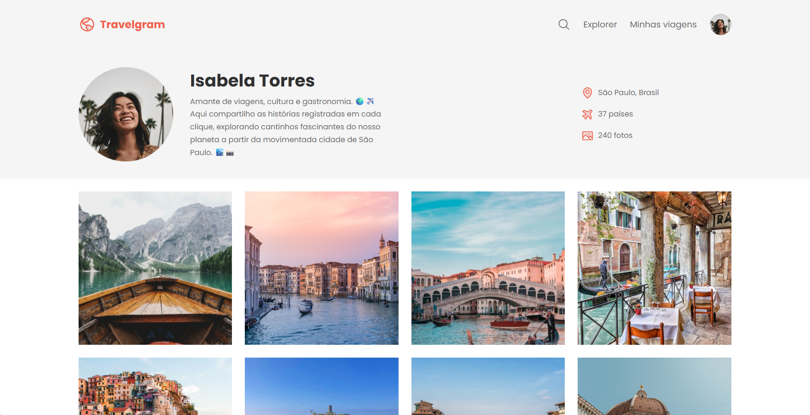
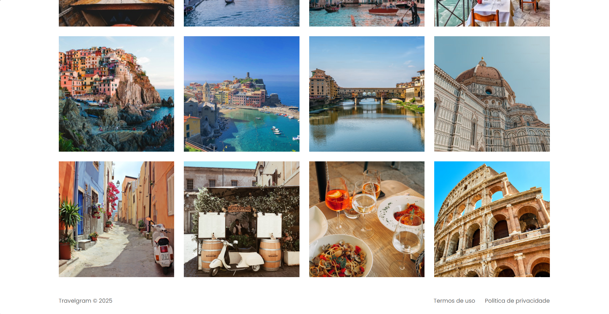

# Travelgram 🌍✈️

A modern and responsive travel profile showcase website featuring a photo gallery and user information. Travelgram is a static website that displays a traveler's profile, including their journey statistics and a beautiful photo gallery of visited destinations.

## 📋 Overview

Travelgram is a clean and elegant profile page for travel enthusiasts to showcase their adventures. The project demonstrates modern HTML5 and CSS3 techniques with a focus on responsive design and user experience.

## 🖥️ Project Preview



<br>



## ✨ Features

- **Profile Section**: Displays user information including bio and profile picture
- **Travel Statistics**: Shows key metrics (location, countries visited, total photos)
- **Photo Gallery**: Grid layout showcasing 12 travel photos
- **Navigation Bar**: Clean navigation with search functionality and quick links
- **Responsive Design**: Mobile-friendly layout that adapts to different screen sizes
- **Modern UI**: Uses custom CSS variables for consistent theming

## 🛠️ Technologies Used

- **HTML5**: Semantic markup structure
- **CSS3**: Modern styling with custom properties (CSS variables)
- **Google Fonts**: Poppins font family for typography
- **SVG Icons**: Scalable vector graphics for UI elements

## 📁 Project Structure

```
Travelgram/
├── index.html              # Main HTML file
├── README.md              # Project documentation
├── assets/
│   ├── icons/             # SVG icon files
│   │   ├── AirplaneTilt.svg
│   │   ├── Image.svg
│   │   ├── MagnifyingGlass.svg
│   │   └── MapPin.svg
│   ├── images/            # Photo gallery images
│   │   └── Image 01-12.png
│   ├── Logo.svg           # Site logo
│   └── Profile pic.png    # User profile picture
└── styles/
    ├── index.css          # Main CSS import file
    ├── global.css         # Global styles and CSS variables
    ├── nav.css            # Navigation bar styles
    ├── header.css         # Header section styles
    ├── main.css           # Main gallery styles
    └── footer.css         # Footer styles
```

## 🎨 Design System

The project uses a consistent design system with CSS custom properties:

### Colors
- **Brand Color**: `#EF5F4C` (Coral red)
- **Background**: `#FFF` (White)
- **Surface**: `#F5F5F5` (Light gray)
- **Text Primary**: `#313131` (Dark gray)
- **Text Secondary**: `#6C6C6C` (Medium gray)

### Typography
- **Font Family**: Poppins (Google Fonts)
- **Font Sizes**: 
  - Large: 32px (bold)
  - Regular: 16px
  - Medium: 14px
  - Small: 12px

## 🚀 Getting Started

### Prerequisites

- A modern web browser (Chrome, Firefox, Safari, Edge)
- A code editor (VS Code, Sublime Text, etc.) - optional for modifications

### Installation

1. Clone the repository:
```bash
git clone https://github.com/HenricoBirochi/Travelgram.git
```

2. Navigate to the project directory:
```bash
cd Travelgram
```

3. Open `index.html` in your web browser:
   - Double-click the `index.html` file, or
   - Use a local development server (e.g., Live Server extension in VS Code)

## 💻 Usage

Simply open the `index.html` file in a web browser to view the website. The page displays:

1. **Navigation**: Site logo and menu with search, explorer, my trips, and profile links
2. **Header**: Profile information for Isabela Torres with travel statistics
3. **Gallery**: Grid of 12 travel destination photos
4. **Footer**: Copyright information and legal links

## 🎯 Future Enhancements

Potential improvements for the project:

- Add JavaScript interactivity (image lightbox, filtering)
- Implement actual search functionality
- Create additional pages (Explorer, My Trips)
- Add image lazy loading for better performance
- Implement dark mode toggle
- Add animations and transitions
- Create a backend for dynamic content management

## 👤 Profile Featured

**Isabela Torres**
- Location: São Paulo, Brazil
- Countries Visited: 37
- Photos Shared: 240

*Travel lover, culture and gastronomy enthusiast. Sharing stories captured in each click, exploring fascinating corners of our planet from the bustling city of São Paulo.*

## 📄 License

This project is available for educational and personal use.

## 👨‍💻 Author

**Henrico Birochi**
- GitHub: [@HenricoBirochi](https://github.com/HenricoBirochi)

## 🙏 Acknowledgments

- Google Fonts for the Poppins font family
- Icons and images used in the project
- Inspiration from modern travel and social media platforms

---

⭐ If you found this project useful, please consider giving it a star on GitHub!
